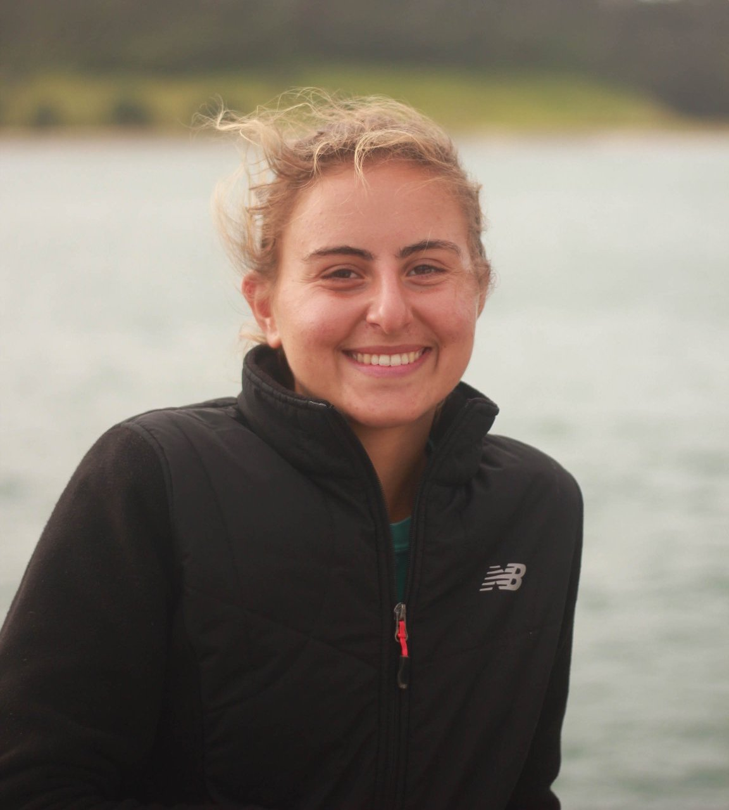

# Arya Jemal for City Council

As a Mission Viejo native, Arya Jemal is no stranger to the issues
facing residents.

As a lifetime resident of Mission Viejo, I understand the issues central to all of us: proper city response to covid-19, job creation, transportation, education, and environmental

As your city councilmember, I commit to serving those in our community who have been previously voices have been previously unheard.

## About

As a lifetime resident of California, Arya Jemal is proud to call
Mission Viejo her hometown. From being part of O’Neill Elementary’s last graduating class to co-founding Mission Viejo High School’s recycling program, Arya knows firsthand the problems facing Mission Viejo and how to curate innovative solutions.

Arya is a graduate of Swarthmore College with a B.A. in Environmental Studies and Political Science where she played on the Women’s Tennis team. Arya is also a graduate of UC Berkeley’s College of Environmental Design with a Certificate in City Planning, focusing specifically on how to create more accessible forms of transportation.

Arya has a strong commitment to education, partnering with multiple organizations throughout Orange County to provide hands-on learning in multiple forms. Arya was specifically involved with the Orange County Department of Education’s nonprofit partner, Inside the Outdoors. She helped write and receive grants to fund environmental projects at high schools in Orange County. She also worked as an educator, teaching programs to a wide range of students.

Arya currently wears many hats. She is the Head Coach for the Mission Viejo High School Boys Tennis team, her alma mater, and works as an environmental educator for the Ocean Institute and the Environmental Nature Center.

Focusing on the voices in our community that have previously fallen on deaf ears, By focusing on education, transportation, and green job creation all centered around an aggressive response to the coronavirus, Arya pledges to use innovative solutions to create a city we are proud to live in.

Issues
------

### Coronavirus Response
  -   Education support for low income families
      -   Scholarships, tech support, loan forgiveness
  -   Small business support
  -   Support for frontline workers
      -   Mental health, child care
      -   Move funding from unnecessary funds (as in the POLICE but can’t
          say that publicly in mv lol) to frontline workers
  -   Support for seniors, those with immunocompromised systems,

  -   Student loan forgiveness, how to help our community college students
  -   Emergency response for the next covid \#\#\# Education
  -   Education support for low income families
  -   Scholarships, tech support, loan forgiveness
  -   Internships aimed at underserved communities
  -   Support Silverado with job training
  -   More services for educators as things are online - helping with the transition

### Job Creation
  -   City implemented job training/creation for youth of color -
  partnered with MV businesses → green jobs, solar installation, green
  roof installation, food generation
  - Initiatives for new small businesses
  - Yout advisory board/task force for ppl of color

### Transportation
  - Better public transportation
  - Bus only lane
  - Bike lanes
  - Pedestrian only areas → especially because of coronavirus, we need
      spaces we can all be in without being too close to each other
  - Electric bikes
  - Bike rental service
  - Scooters
  - Senior transportation
  - Benches/comfortable space when waiting for bus → include art installation

### Small business support
  - Direct \$\$\$
  - Partnerships with small businesses, specifically businesses of color

### Vacant Space as Community Space
  - MV has a lot of vacant space we can turn into community space, esp space that can be used for people during coronavirus in socially distant ways → reservations
  - Utilize the community space we already have - nadadores, marguerite and felipe tennis center, offer more subsidized community programs
# Affordable housing - mission viejo housing authority
  - Lack of affordable housing, more of it and less development
  - Rent control
  - Reduction in property taxes (????)
# Environmental Protection
  - Upkeep of already existing green spaces
  - Creation of new green space
  - Cleanup of bad green spaces - the lake
  - Urban farms
  - Green roofs
  - Env racism/justice → providing job creation for solar installation, etc. → partner with local businesses already doing so
  - Zero waste
  - Solar power

